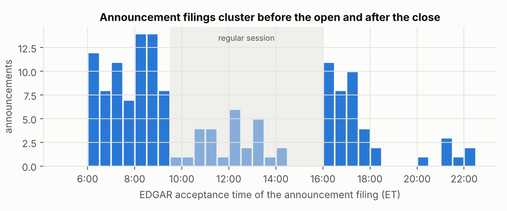
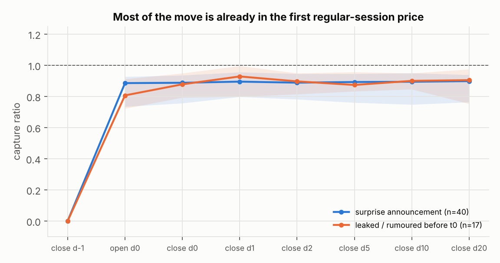
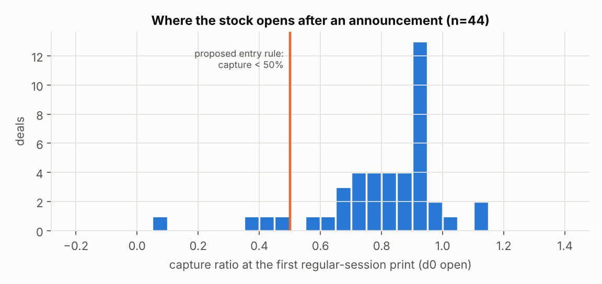
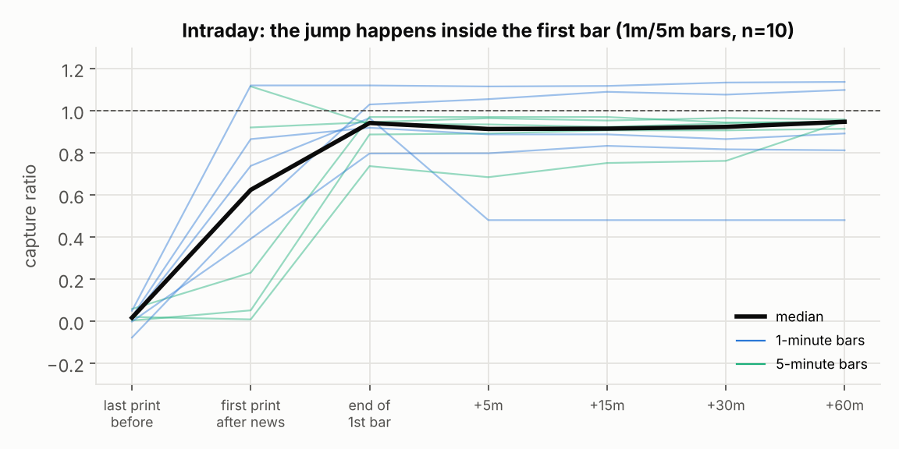
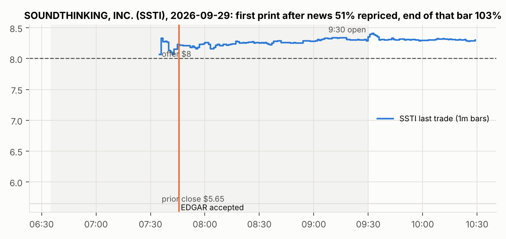
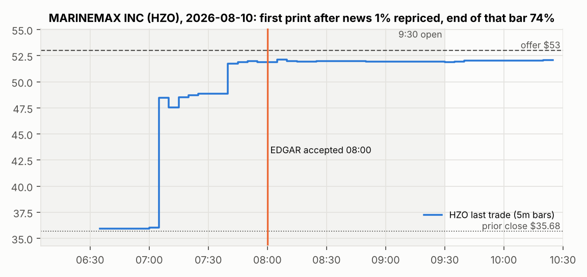

# Acquisition-announcement momentum: is there an edge?

*Research run on 2026-10-06. Code and data are in this repo. Every number below is reproducible with
`scripts/01…07` (see [README](README.md)). Desk research with ~150 cited sources is in
[docs/research_notes.md](docs/research_notes.md).*

---

## 1. Bottom line

1. **"Before the public" is the one part I won't help with, because it is illegal.** Trading on a takeover before
   its public release is trading on material non-public information. That covers embargoed press releases,
   leaked drafts, and anything taken from a newswire or filing agent before it is published. The
   2015 newswire-hacking ring (≈150,000 stolen releases, ≈$100m profit) ended in prison sentences. For tender offers,
   SEC Rule 14e-3 does not even require a breach of duty. What *is* legal is being **first at the moment of
   publication**, by reading the primary sources directly and fast. That is what this study measures and what the
   code does. See §6.
2. **For US deals, your rule (buy if the stock has captured <50% of the move, exit after the initial repricing) has
   no edge in the data.** The repricing happens in the **first trades after the press release, usually within one
   minute and usually pre-market**. By the first regular-session print, the median target has already captured
   **87%** of the move (IQR 72–93%), and from there it goes nowhere (cash deals, open→close: median **0.00%**,
   mean +0.36%, hit rate 47%). The 10–15% gap that remains is the **merger-arbitrage spread**. That spread is the price of
   deal risk and time to close, not slow information processing.
3. **The "<50% repriced" filter mostly picks deals the market doubts, not deals it is slow on.** It triggered on
   4 of 44 deals. The only cash deal among them (PAYO) had already run up 39% on leaks and stayed at 43%
   capture. The other three were stock deals, where "capture" measured against the offer is misleading
   unless you hedge the acquirer.
4. **EDGAR is far too slow to be the trigger.** In 81% of the deals with intraday data, the price had already
   reacted before the SEC filing was accepted. The median lag was **~2 hours**. The press release on the newswire is
   the real first publication. Free newswire RSS feeds showed items **1–7 minutes** after their stated publication
   time. That alone is too slow for a repricing that finishes inside a minute.
5. **Three pockets are worth a proper test with better data:**

   | | Pocket | What we saw | Sample |
   |---|---|---|---|
   | A | **Stock-for-stock deals, hedged** (long target, short exchange-ratio × acquirer) at the d0 open, held to the close | +1.9% mean, +2.9% median, 7/8 positive, t≈2.0. Matches the known "arbitrage price pressure" mechanism: arbitrage capital arrives over the first day. | n=8 |
   | B | **After-hours announcements** (16:00–20:00 ET): buy at the end of the first after-hours hour, sell at the next open | +3.4% mean, +1.3% median, 4/5 positive | n=5 |
   | C | **Pre-market, first minutes, small caps**: for example MarineMax sat at ~74% captured for ~35 min before jumping to 94% (+7%) | +0.8% mean, +0.5% median from the end of the first hour to the close | n=20 (60-min bars) |

   None of these is statistically solid yet. A and B are the ones I would pay to test. Costs and the exact test
   are in §7.
6. **If you want "slow markets", the research points to the UK (leak announcements during trading hours with no
   halt), India (intraday board-meeting disclosures) and Turkey (measurably slower reaction to KAP disclosures).**
   Each has a catch: price bands, partial offers, or ±10% limits. Most of Asia-Pacific (Australia, Japan, Korea,
   Hong Kong, Malaysia, Philippines, Singapore) halts trading on deal news, which removes the window.

---

## 2. What has to be true for the strategy to work

Three conditions. All three must hold:

| # | Condition | US evidence |
|---|---|---|
| 1 | The news reaches you, machine-readable, at publication time | Yes: newswires, EDGAR and halt feeds are all pollable. Free sources are 1–7 min late, paid feeds are sub-second (§5). |
| 2 | Price discovery takes longer than your end-to-end latency | **Mostly no.** The first minute after the release does most of the work (§4.3). Exchanges halt or require pre-notification for intraday releases. |
| 3 | The remaining move exceeds spread + slippage + fees, and is not just deal-risk compensation | **No for cash deals.** The residual gap is the arbitrage spread, and the price does not drift toward the offer on any horizon from minutes to 20 days (§4.2). |

---

## 3. Data and method

**Events.** All from SEC EDGAR, 2010–2026:
- **Anchors.** 9,084 merger-proxy and tender-offer filings (`PREM14A`, `DEFM14A`, `SC 14D9`, `SC14D9C`) from the
  quarterly indexes, clustered into 4,794 deals.
- **Recent deals.** The 75 days before the run. Merger proxies arrive weeks after the announcement, so deals this
  recent were picked up from 2,096 announcement-day filings (`DEFA14A`, `SC14D9C`, `SC TO-C`, `425`) instead.
- **Announcement.** For each target, the pipeline walks back to the first filing announcing that *the company
  itself* is being acquired. It then extracts terms with transparent regexes: cash per share, exchange ratio, CVR,
  the stated premium, and the tickers mentioned. It records the EDGAR acceptance time to the second.

**Prices.** Yahoo chart API:
- Daily bars, plus intraday bars including pre- and post-market: 1-min for ≈30 days back, 5-min for ≈60 days,
  60-min for ≈2 years.
- **Free sources drop delisted tickers, so only targets still trading could be priced.** That means pending deals
  (mostly 2025–26) and failed deals (older years). On announcement day nobody knows the outcome, so the day-0
  dynamics should not be badly biased. Still, this is the main limitation, and §7 fixes it.

**The measure.** Your critical variable, generalised to stock deals:

```
capture(t) = (P_t − P_pre) / (V_t − P_pre)
```

- `P_pre` is the last regular close before the news.
- `V_t` is the offer value per share: the cash amount, or ratio × acquirer price at the same moment (plus any cash).

**Guarding against look-ahead.** An entry at the d0 open counts only when EDGAR shows the news was public before
9:30 ET. 13 of 57 deals were excluded from open-entry tests for this reason. Intraday, the "reaction" is the first
bar where price moves ≥35% of the way to the offer **and stays there for 30 minutes**, which filters bad ticks.

| Sample | n |
|---|---|
| Announcements with terms and a still-listed ticker | 144 |
| Daily clean sample (validated against price, 5–200% premium) | **57** (44 with news before the open) |
| Intraday cash-deal sample (1-min: 5, 5-min: 5, 60-min: 27) | **37** |
| Non-binding take-private proposals (secondary study) | 22 of 88 priced |

---

## 4. Results

### 4.1 When deals come out



51% of announcement filings were accepted before 9:30 ET, 30% after 16:00, and 19% during regular hours. EDGAR time is
an *upper bound* on release time, so the true pre-market share is higher. In practice, the race happens in the
thin **pre-market (from 4:00 ET)** or **after-hours (until 20:00 ET)** sessions, not in the regular session.

### 4.2 Daily: the stock opens near its equilibrium and stays there



| Median capture | open d0 | close d0 | close d1 | close d5 | close d20 |
|---|---|---|---|---|---|
| Surprise announcements (n=40) | 0.89 | 0.89 | 0.90 | 0.89 | 0.90 |
| Leaked / rumoured beforehand (n=17) | 0.81 | 0.88 | 0.93 | 0.87 | 0.91 |



Buy at the d0 open (news provably public), sell later:

| Deals | d0 close | d1 close | d5 close |
|---|---|---|---|
| Cash deals (n=36): mean / median / hit | +0.36% / 0.00% / 47% | +0.58% / +0.13% / 58% | +0.43% / +0.29% / 56% |
| Stock deals, **hedged** (n=8): mean / median / hit | **+1.93% / +2.88% / 88%** | +1.35% / +2.79% / 88% | +0.95% / +2.20% / 88% |

- For cash deals, a 25 bp round-trip cost removes everything.
- By capture bucket at the open, only the 50–80% bucket shows a positive mean: +1.5% to the close, but median −0.07% (n=13).
  It disappears in cash-only deals. That is consistent with Bessembinder & Zhang's finding that low-priced targets
  earn a risk premium, not a momentum effect.
- Full tables: [results/tables.md](results/tables.md).

**Stock-for-stock deals behave differently**, and in the direction your thesis predicts:

| Target | Acquirer | Capture at open → close | Hedged d0 |
|---|---|---|---|
| TCBK | FHB | 0.48 → 0.87 | +3.0% |
| BRBS | HTB | 0.36 → 0.74 | +4.4% |
| VAL | RIG | 0.68 → 0.87 | +3.0% |
| CHMI | MITT | 0.71 → 0.83 | +2.8% |
| SYNA | ON | 0.08 → 1.42 | +4.0% |
| FNWD | FFBC | 0.79 → 0.89 | +1.6% |
| D | NEE | 0.56 → 0.54 | +0.9% |
| MGRC | WSC | 1.04 → 0.71 | −4.3% |

**Mechanism:** arbitrage capital has to compute the implied value, locate a borrow and short the acquirer. So the
spread closes over the first session instead of the first seconds. Mitchell, Pulvino & Stafford (JF 2004) document
the acquirer-side price pressure from this shorting. Small-cap bank mergers (3 of the 8) are a steady supply of
these deals.

### 4.3 Intraday: the jump happens inside the first bar



| Median capture | first print after news | end of first bar | +60 min | regular open | regular close |
|---|---|---|---|---|---|
| 1-min bars (n=5) | 0.74 | **0.97** | 0.89 | 0.88 | 0.90 |
| 5-min bars (n=5) | 0.23 | 0.94 | 0.95 | 0.94 | 0.94 |
| 60-min bars (n=27) | 0.35 | 0.86 | 0.87 | 0.88 | 0.88 |

Two archetypes:



**SoundThinking (Sep 29, 2026).** No trades between the prior close and the release. The first trade after the news,
at 07:35, printed at ~51% captured. **By the end of that same minute** the stock was above the $8 offer. All of this
happened ten minutes before the EDGAR filing. Even a one-minute-latency system would have found nothing left.



**MarineMax (Aug 10, 2026).** In the 07:05 bar, the price jumped from the old level to ~74% captured. It then sat at $47.5–49 for ~35 minutes
before moving to $51.8 (≈94%) at 07:40. That was still 20 minutes before the EDGAR filing. A buyer at ~$48.5 would
have made **≈+7%** by the open. This is exactly your thesis, but it showed up in 1 of 10 deals with fine-grained
bars.

Late but realistic entries (end of the first bar after the news, then exit):

| Session of the news | Bars | Exit at next regular open | Exit at regular close |
|---|---|---|---|
| Pre-market | 60-min (n=20) | +0.49% mean / +0.16% median | +0.84% / +0.53% (t=1.8) |
| Pre-market | 5-min (n=5) | +1.32% / +0.24% | +1.45% / +0.08% |
| Pre-market | 1-min (n=4) | +0.40% / +0.26% | −0.07% / −0.45% |
| **After-hours** | 60-min (n=5) | **+3.37% / +1.28%, 4/5 positive** | +3.11% / +1.28% |

**Caveat:** these are last-trade prices. In extended hours, a trade print does not prove you could have bought
there, because the ask had usually moved already. Extended-hours spreads in small caps are much wider than in the
regular session. If they run at roughly 0.5–2% (an assumption this data cannot check), they would eat the
pre-market numbers. Only NBBO quote data can settle it (§7).

### 4.4 Non-binding take-private proposals: no momentum

22 validated episodes from 13D Item 4 letters and 8-Ks:
- The market prices a public non-binding proposal at a **median 32% capture** of the proposed premium.
- From the first post-filing price, the mean return was −0.2% by the d0 close, +0.3% by d5 and **−3.6% by d20**.
- Uncertainty is priced, and if anything over-priced on the upside. There is no drift to ride.
- Details: [results/proposals.md](results/proposals.md).

### 4.5 Leaks

- 17 of 57 deals (30%) had already moved a lot before the official release: a measured premium below 60% of the
  stated premium, or a >15% run-up.
- For those deals, the *rumour day* was the real event. The literature agrees: Ahern & Sosyura find rumour-day
  returns of +4.3%, but only 33% of rumours become bids within a year, and false ones fully reverse.
- Silicon Labs (Feb 3–4, 2026) is a live example. It jumped to ~50% capture in the after-hours session on Feb 3,
  apparently on a media report, since the official release and the 8-K came at ~07:05 on Feb 4. It then reached
  ~73% at the next morning's first pre-market prints and held there.

---

## 5. Where to get the news fastest (legally)

| Rank | Source | Latency vs first public release | Cost | Notes |
|---|---|---|---|---|
| 1 | Dow Jones low-latency newswires, Bloomberg Event-Driven Feeds, LSEG Machine Readable News | ms (LSEG claims <3 ms) | $$$ | What the HFTs that reprice SSTI in one minute use |
| 2 | Exchange halt messages (SIP / Nasdaq ITCH; Nasdaq halts RSS for free) | real time | free–$$ | A T1 "news pending" halt says news is coming, not what it is |
| 3 | RavenPack-type analytics | ~300 ms after DJ (2013 study) | $$$ | |
| 4 | Benzinga news websocket (also via Alpaca / Polygon news streams) | ~1–3 s behind Bloomberg/Reuters (reviewer estimate) | $–$$ | **Best realistic retail-tier trigger** |
| 5 | Newswire RSS (PR Newswire, GlobeNewswire, Business Wire): polled directly by `mnaarb.live` | **measured here: PRN +64–123 s, GNW +113 s, BW +433 s** after stated publication | free | Too slow for a one-minute repricing |
| 6 | EDGAR (`data.sec.gov` <1 s after dissemination; website 1–3 min) | **measured here: median ~2 h after the price reacted**; price moved first in 81% of deals | free (10 req/s) | Use for confirmation and terms parsing, not as the trigger |
| 7 | X relay accounts (e.g. "Walter Bloomberg") | seconds–minutes | free | Unofficial; a false tariff headline once moved ~$2.5tn: dangerous as an automated trigger |

- **Direct newswire feeds are closed to fast traders.** Business Wire and Marketwired stopped selling direct feeds to
  HFT firms in 2014. PR Newswire requires customers to certify they won't use its feed for high-frequency trading.
- **Practical stack for a retail-sized system:**
  - Trigger: Benzinga via the Alpaca news websocket.
  - Terms: parse the release text (`mnaarb.extract`).
  - Confirmation and halts: Nasdaq halts and EDGAR.
  - Execution: a broker with 4:00–20:00 extended-hours routing.
- The repo's `mnaarb.live` already polls the free primary sources concurrently. Adding a websocket source is a
  single new `SOURCES` entry.

---

## 6. The legal line ("before the public")

| Legal | Not legal |
|---|---|
| Paying for a faster feed of information released to everyone at the same moment (DJ, Bloomberg, Benzinga) | Any access to a release before it is published: embargoed copies, filing-agent or newswire systems, printers, advisers (MNPI; misappropriation theory, *O'Hagan*, *Carpenter*) |
| Trading on already-published rumours and press reports | Hacking or deceiving your way to unpublished releases (*SEC v. Dorozhko*; the 2015 newswire hack: 5-year sentence, $14.4m forfeiture) |
| Reading EDGAR, halt feeds and exchange portals as fast as their fair-access rules allow | Tender offers: any MNPI from bidder or target once a "substantial step" is taken, with no breach of duty needed (Rule 14e-3) |

Regulators have also pushed back on paid *early* access to releases, such as Thomson Reuters' 2-second early
University of Michigan survey and EDGAR's old PDS head start. Anything that sells you news "before the public" is a
red flag, not an edge. This isn't legal advice; check anything borderline with counsel.

---

## 7. What I'd do next (if you want to keep going)

1. **Fix the data limitation first (≈1–2 weeks, a few hundred dollars).**
   - Buy trades and NBBO quotes, including delisted tickers, from a vendor such as Polygon/Massive, Databento or TAQ via WRDS.
   - Rerun `scripts/02_build_events.py --all` (all 4,794+ deals since 2010).
   - Point `mnaarb/prices.py` at the new source (`polygon_bars` is already written).
   - Measure capture at +1 s / 5 s / 30 s / 1 min / 5 min **at the executable ask**, split by session and
     consideration. This turns every "suggestive" result above into a yes or a no.
2. **Test pocket A at scale.** Stock-for-stock deals, hedged, d0 open → close, with borrow costs. Mitchell–Pulvino–Stafford
   gives a prior that it is real. Expect hundreds of US bank, REIT and energy stock deals in the full history.
3. **Test pocket B at scale.** After-hours announcements with quote data. The open question is whether the
   after-hours ask at minute 5–30 sits below the next morning's open by more than the spread.
4. **Only then wire live:**
   - Benzinga/Alpaca news websocket → `extract_terms` → `live.evaluate` (already computes capture and remaining move).
   - Paper trading on Alpaca first.
   - Capacity is small by nature: thin extended-hours books, and ~100–250 US public-target deals a year.
5. **For non-US markets,** start with the UK. RNS is pollable, the Takeover Code makes leak announcements immediate
   with no halt, and Yahoo serves LSE intraday bars. India and Turkey come next, but price bands need special handling.

---

## Appendix: limitations

- **Survivorship.** Free prices exist only for targets still trading, so pending (recent) and failed (older) deals
  are over-represented. The daily sample is 57 deals, not thousands. Treat effect sizes as preliminary.
- **Bars are trades, not quotes.** Extended-hours prints can sit far from the executable price.
- **Resolution.** The finest free resolution is 1 minute (last ≈30 days only). The question you asked, how much moves
  in 1 s / 5 s / 10 s / 30 s, needs tick data.
- **Extraction errors.** Regex extraction misreads some deals. Every event is cross-checked against prices
  (implausible ones are tagged `suspect` and excluded), and two intraday rows with bad ticks were dropped (DBRG, GPRO).
- **Live latency sample.** It was collected on a weekday evening (fewer releases). Run `python -m mnaarb.live` across a
  US pre-market (06:00–09:30 ET) for a proper sample, then `scripts/05_latency.py`.
